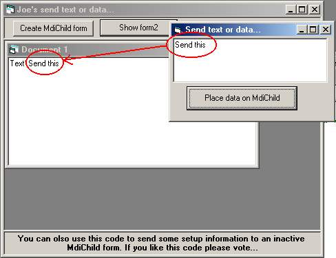



## A simple NO API sendd data to MDIChild

### Description

This is simple NO API send data to an inactive MdiChild code, just using a timer...
 
### More Info
 

             |
---                |---
**Submitted On**   |2003-09-08 05:09:02
**By**             |[Joe Igorevitch Pritoulski](https://github.com/Planet-Source-Code/PSCIndex/blob/master/ByAuthor/joe-igorevitch-pritoulski.md)
**Level**          |Beginner
**User Rating**    |5.0 (10 globes from 2 users)
**Compatibility**  |VB 6\.0
**Category**       |[Miscellaneous](https://github.com/Planet-Source-Code/PSCIndex/blob/master/ByCategory/miscellaneous__1-1.md)
**World**          |[Visual Basic](https://github.com/Planet-Source-Code/PSCIndex/blob/master/ByWorld/visual-basic.md)
**Archive File**   |[A\_simple\_N164277982003\.zip](https://github.com/Planet-Source-Code/joe-igorevitch-pritoulski-a-simple-no-api-sendd-data-to-mdichild__1-48344/archive/master.zip)

### API Declarations

NO API

